https://youtu.be/1Yy5Bjkt7Cg
https://youtube.com/shorts/ypZxpvX-Bhg

#FestixAPI
## Clean the project
`flyway -users="postgres" -password="xhesHLa7qKAK" -url="jdbc:postgresql://localhost:5432/festix" clean`

#Install the project
- créer une base de donnée postgresql, nommé 'festix'
- changer dans le fichier `application.yml`
````
    datasource:
       password: xhesHLa7qKAK
       url: jdbc:postgresql://localhost:5432/festix
       username: postgres
    flyway:
       enabled: true
       out-of-order: true
       baseline-on-migrate: true
       user: postgres
       password: xhesHLa7qKAK
       url: jdbc:postgresql://localhost:5432/festix
    server:
       address: 192.168.1.33
       port: 8080
````
Les champs password, url, et username / user, doivent être modifié en conséquence en fonction de votre base de donnée


#Configuration
Vous devez également changer les informations du serveur, le plus simple est de faire en sorte (dans un cas local), 
que votre la ligne server, corresponde à votre adresse de réseaux local. 
Lorsque vous tapez 'ipconfig' pour windows, dans un terminal, vous trouverez votre adresse IP, 
Changez alors en conséquence la ligne 'adress' et choisissez le port qui vous convient le plus.


# Rendu du projet : 
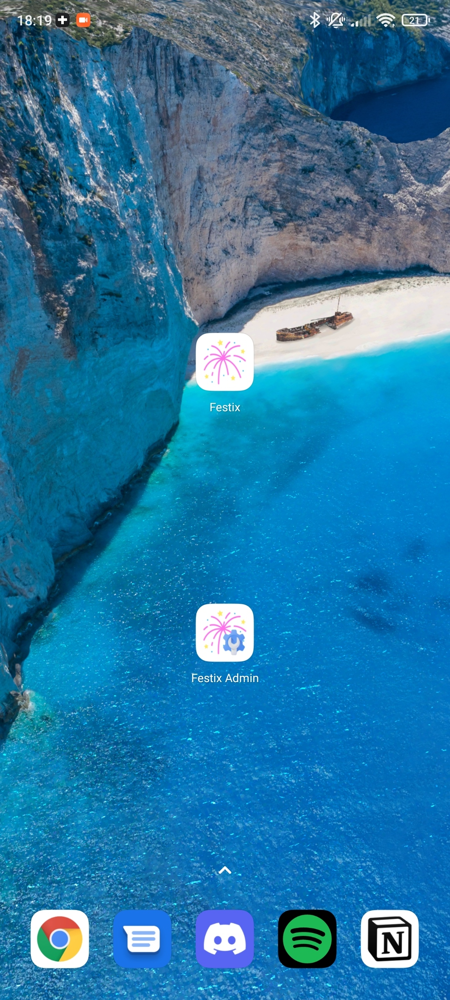
## Explication - Rendu WORD
<a href="Rendu/Rendu.pdf">Rendu pdf</a>
## Visiteur
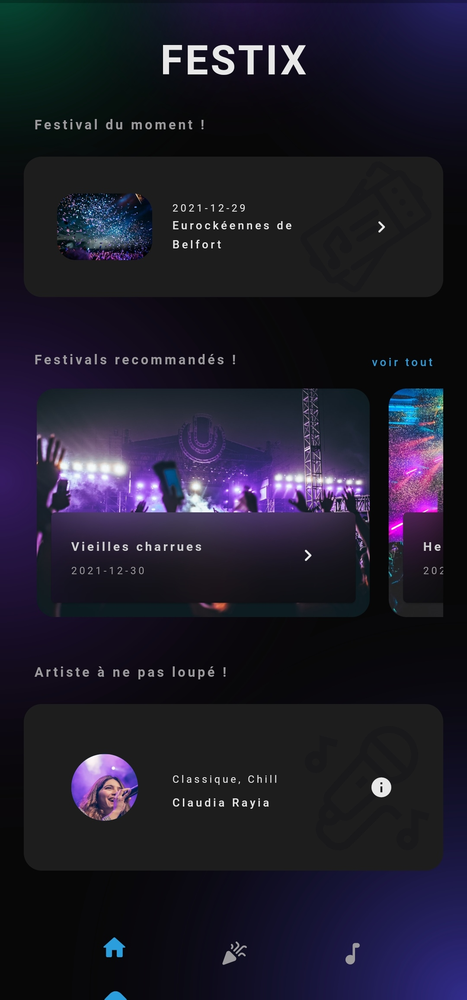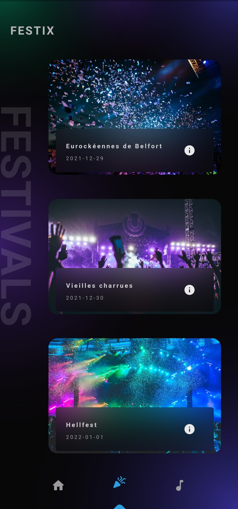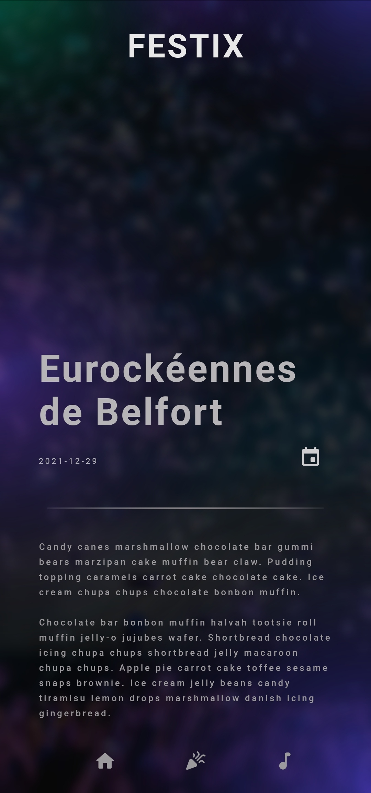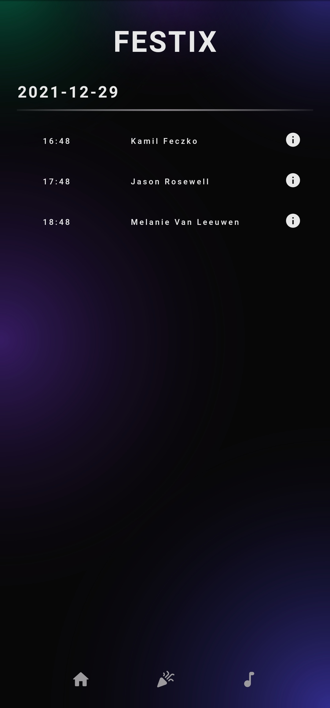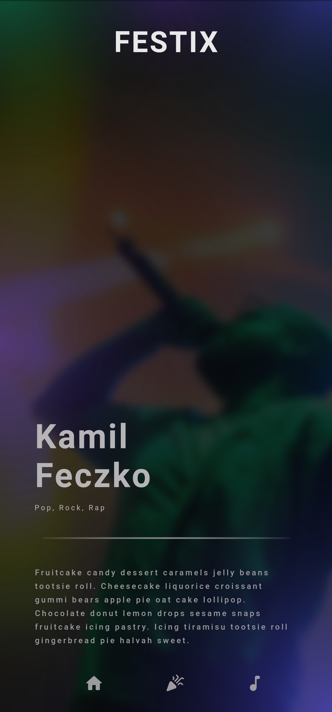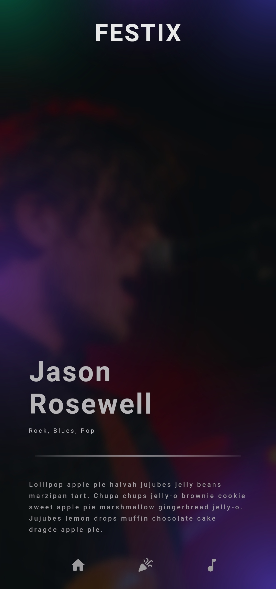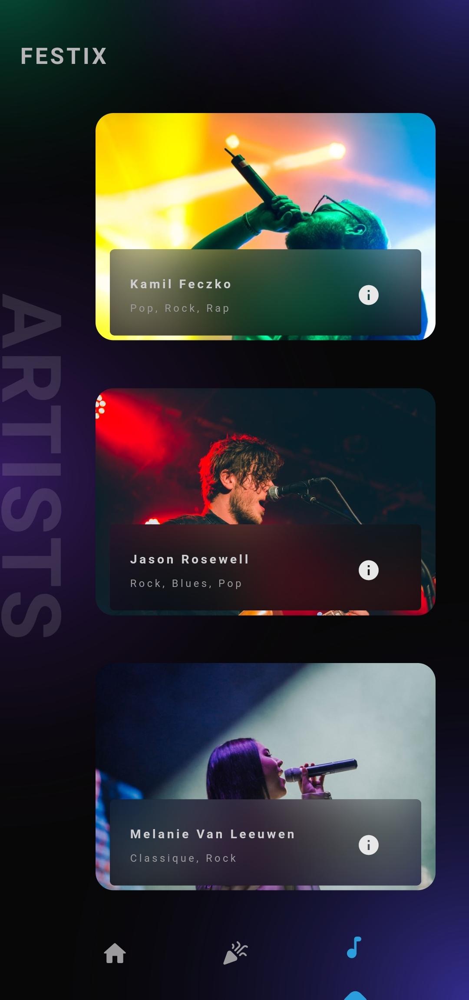
## Admin
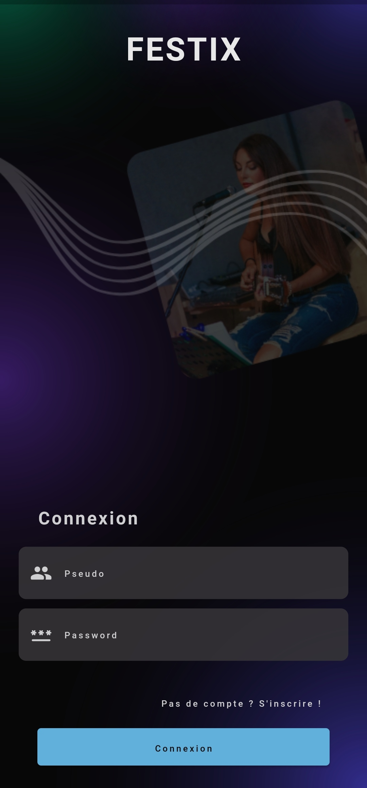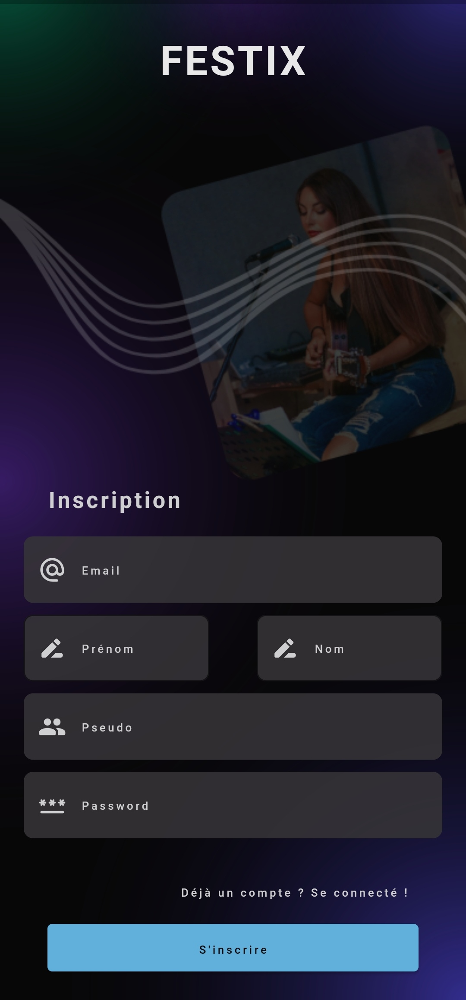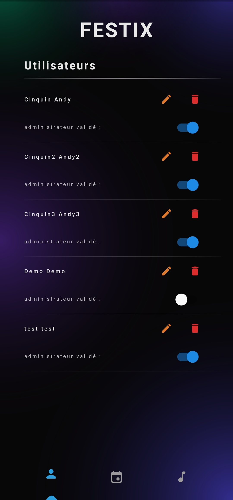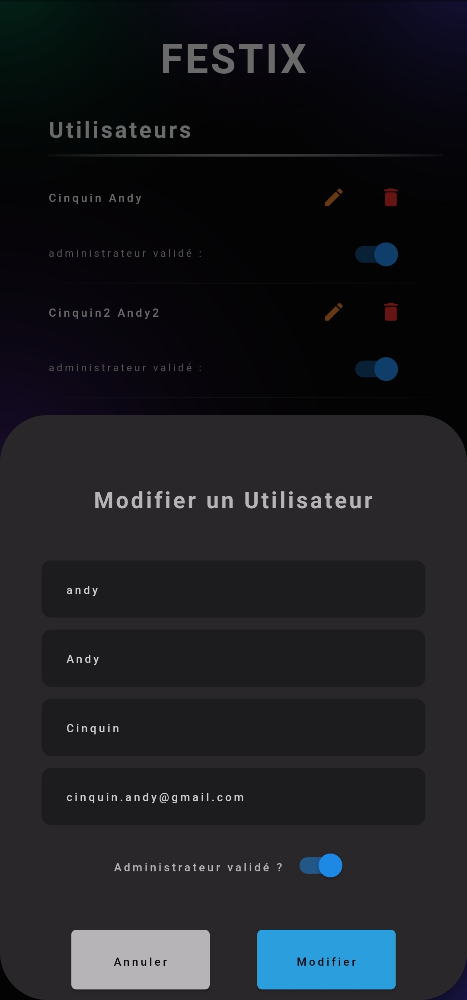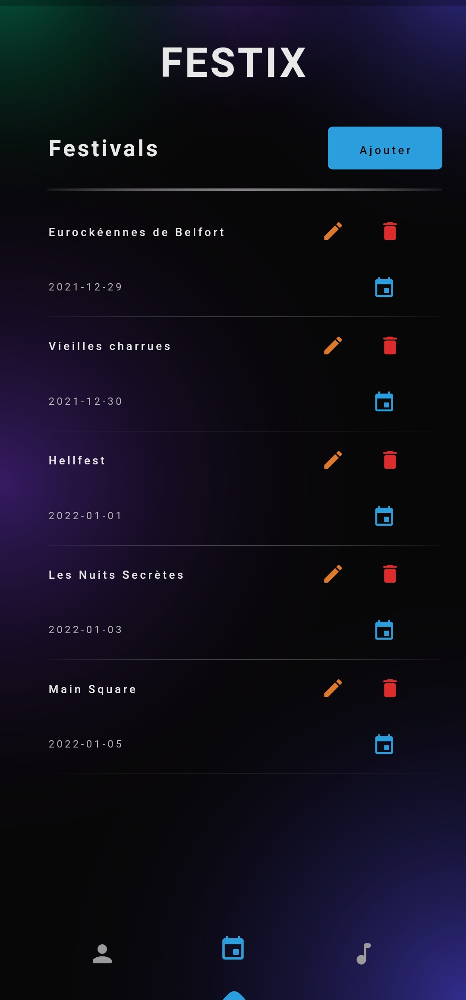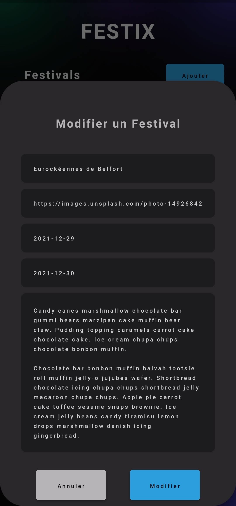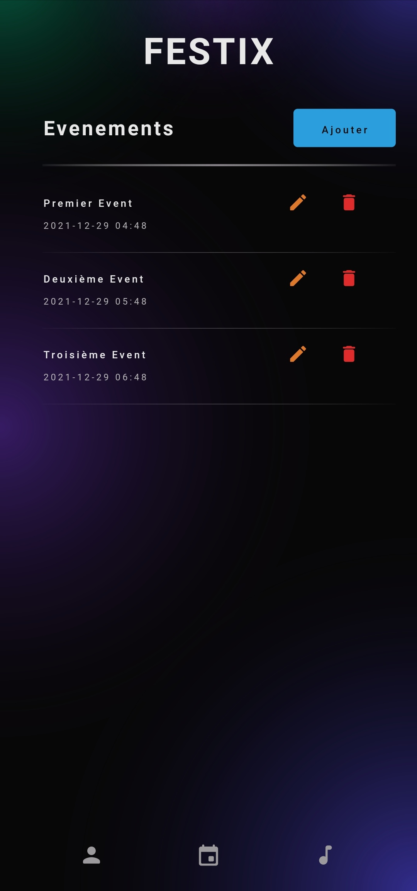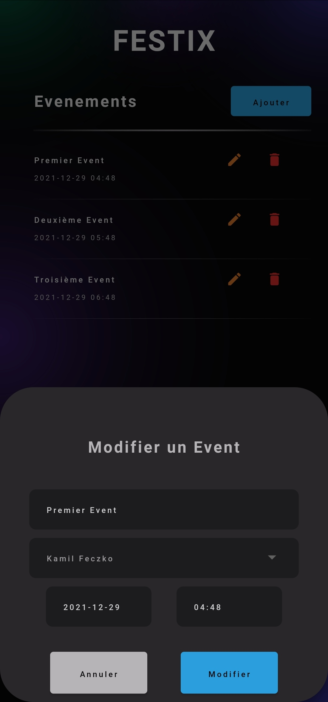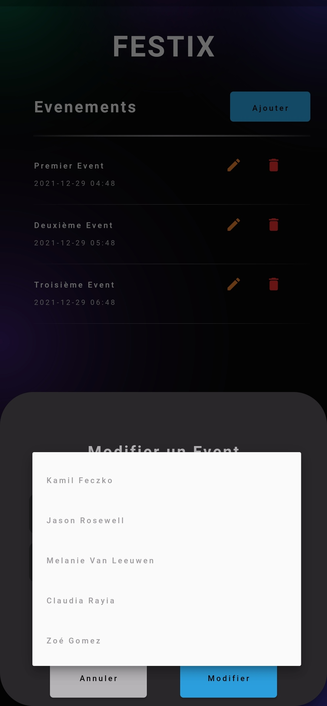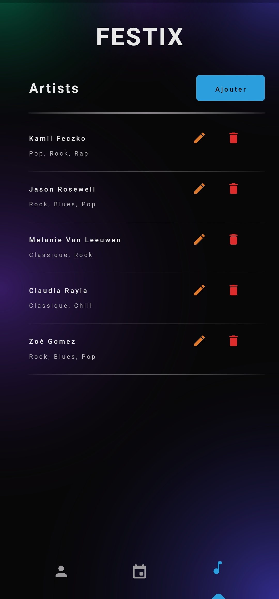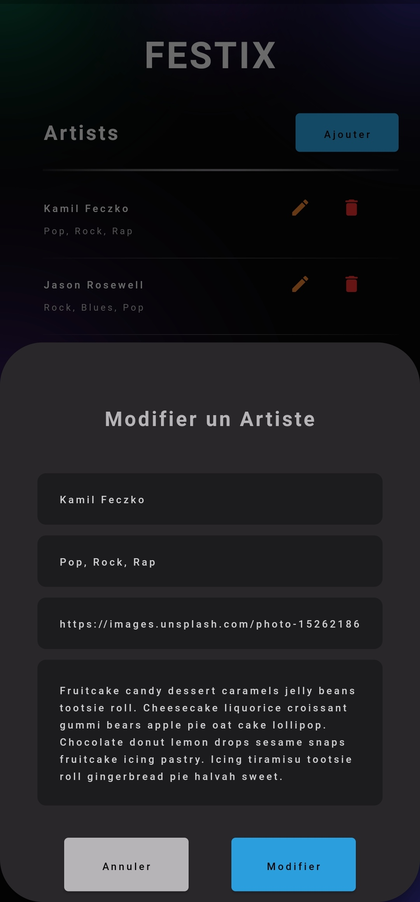
